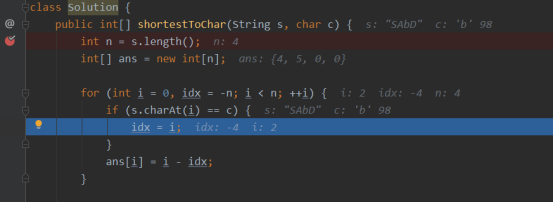
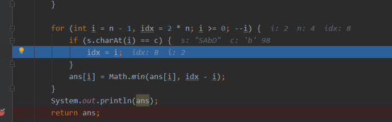
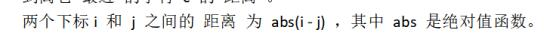
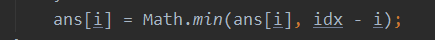
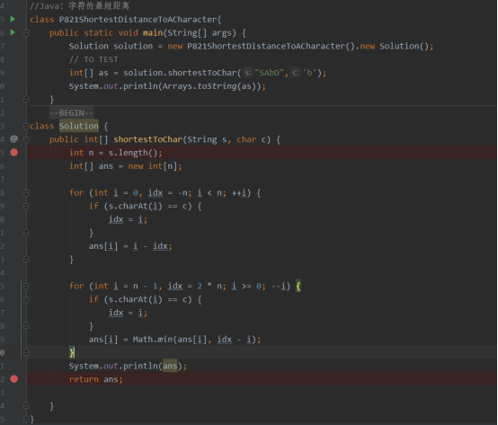
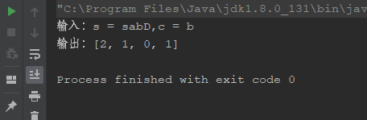

每日一题

821. 字符的最短距离

给你一个字符串 s 和一个字符 c ，且 c 是 s 中出现过的字符。
返回一个整数数组 answer ，其中 answer.length == s.length 且 answer[i] 是 s 中从下标 i 到离它 最近 的字符 c 的 距离 。
两个下标 i 和 j 之间的 距离 为 abs(i - j) ，其中 abs 是绝对值函数。

 

示例 1：

输入：s = "loveleetcode", c = "e"
输出：[3,2,1,0,1,0,0,1,2,2,1,0]
解释：字符 'e' 出现在下标 3、5、6 和 11 处（下标从 0 开始计数）。
距下标 0 最近的 'e' 出现在下标 3 ，所以距离为 abs(0 - 3) = 3 。
距下标 1 最近的 'e' 出现在下标 3 ，所以距离为 abs(1 - 3) = 2 。
对于下标 4 ，出现在下标 3 和下标 5 处的 'e' 都离它最近，但距离是一样的 abs(4 - 3) == abs(4 - 5) = 1 。
距下标 8 最近的 'e' 出现在下标 6 ，所以距离为 abs(8 - 6) = 2 。
示例 2：

输入：s = "aaab", c = "b"
输出：[3,2,1,0]
 

提示：
1 <= s.length <= 104
s[i] 和 c 均为小写英文字母
题目数据保证 c 在 s 中至少出现一次


解题思路：
方法分析：两次遍历for循环双次遍历
可以变成双向循环遍历下标值和目标字符位置。

s[i] 到其左侧最近的字符 c 的距离
s[i] 到其右侧最近的字符 c 的距离
分别计算最小值。

1.对于前者，我们可以从左往右遍历 s，若 s[i]==c 可以标记idx 



2.对于后者，我们可以从右往左遍历 s，若 s[i]==c 则记录下此时字符 c 下标idx 



注意：
1.从左往右遍历时候给ans[i]更新，因为这是第一次更新，记录长度从右往左也是需要更新。





2.从右往左更新属于二次扫盲更新 ，并比较和第一次最小值。


 

3.为什么把idx取 -n 和2n ？
因为-n设置初始值长度相反总是比长度小等于。且正向增加也是跟二次循环比是最小的。在二次右循环2n设置正向无穷大从无穷大向左移动，赋值时侯更新以此递减更新最小值。

代码解图：






代码：

```
package leetcode.editor.cn;

import java.util.Arrays;

//Java：字符的最短距离
class P821ShortestDistanceToACharacter{
    public static void main(String[] args) {
        Solution solution = new P821ShortestDistanceToACharacter().new Solution();
        // TO TEST
        String s = "sabD";
        char c = 'b';

        int[] as = solution.shortestToChar(s,c);

        System.out.println("输入：s = " + s+","+"c = "+c);
        System.out.println("输出："+Arrays.toString(as));

    }
    //leetcode submit region begin(Prohibit modification and deletion)
class Solution {
    public int[] shortestToChar(String s, char c) {
        int n = s.length();
        int[] ans = new int[n];

        for (int i = 0, idx = -n; i < n; ++i) {
            if (s.charAt(i) == c) {
                idx = i;
            }
            ans[i] = i - idx;
        }

        for (int i = n - 1, idx = 2 * n; i >= 0; --i) {
            if (s.charAt(i) == c) {
                idx = i;
            }
            ans[i] = Math.min(ans[i], idx - i);
        }

        return ans;

    }
}
}
//leetcode submit region end(Prohibit modification and deletion)
```


